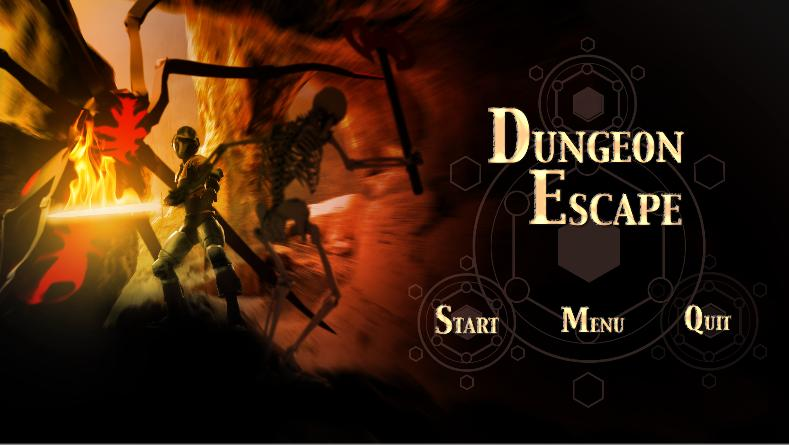
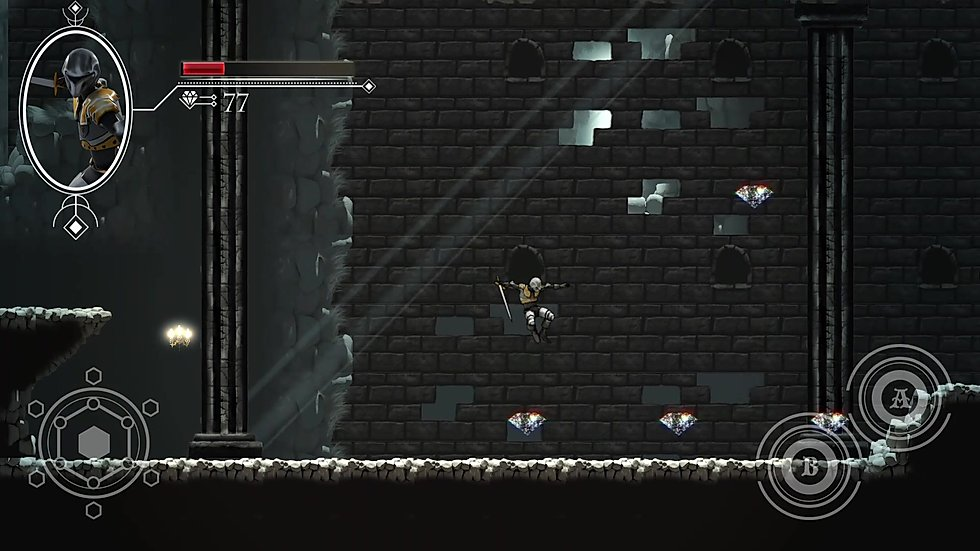
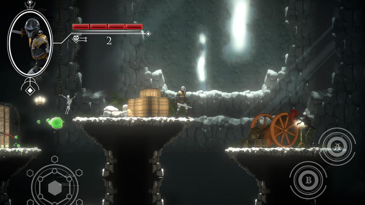
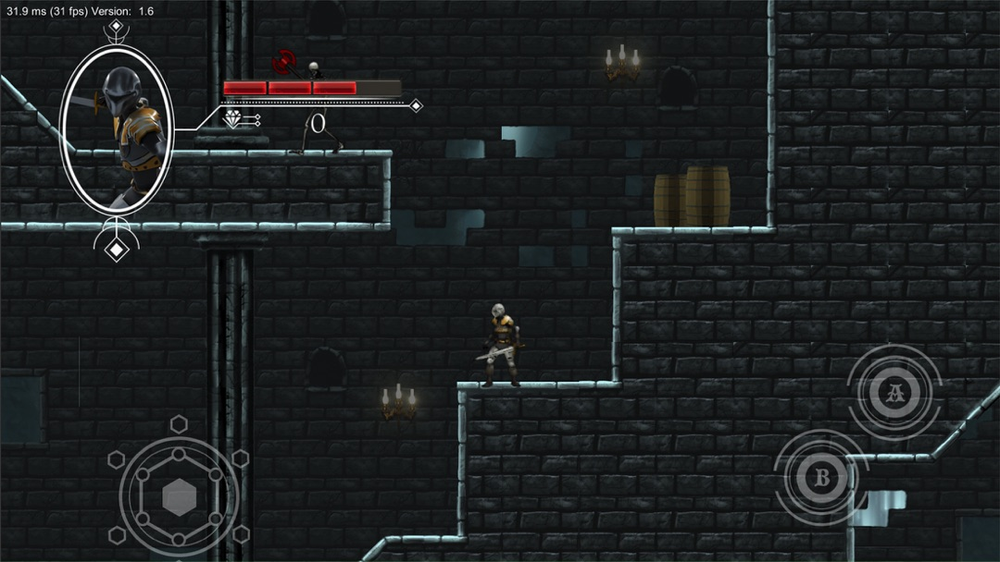

# Dungeon-Escape
Welcome to Dungeon Escape.

This is my project created from the Udemy course,
The Ultimate Guide to 2D Mobile Game Development in Unity.

# Description

Dungeon Escape is a 2D Platformer / Dungeon crawler.
Currently the game consists of one level where the user must collect enough
diamonds through out the level to purchase the Key to the Castle while avoiding various enemies.

It contains a simple Inventory system for simple PowerUps.
The flame sword - Added swing effect to the players sword along with a damage increase, lasts for 2mins.
Boots of Flight - Increased jump ability and decrease in gravity allowing the player to reach the final castle.
Key to the Castle - Required item to gain access to the castle to collect end of level score.

## Motivation
It is a personal project developed by me in Unity. It is basically developed for enhancing my skills in Unity by having a overview on the design and implementing the experience.

# Screenshots

## License
[MIT](https://choosealicense.com/licenses/mit/)

